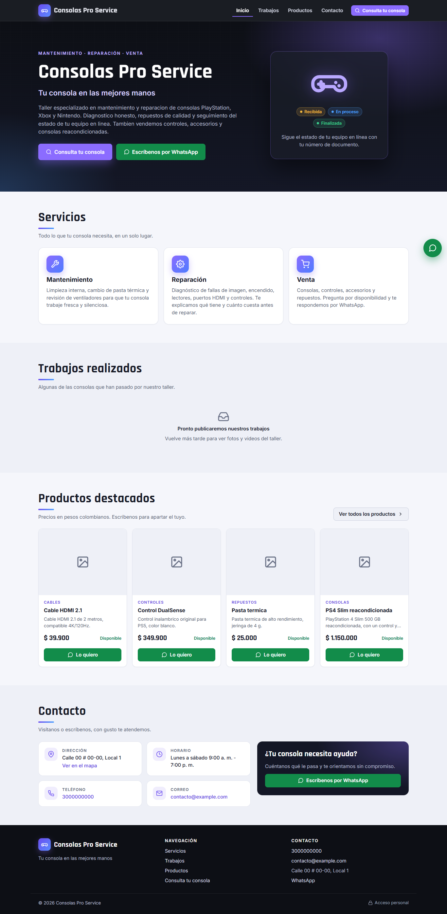
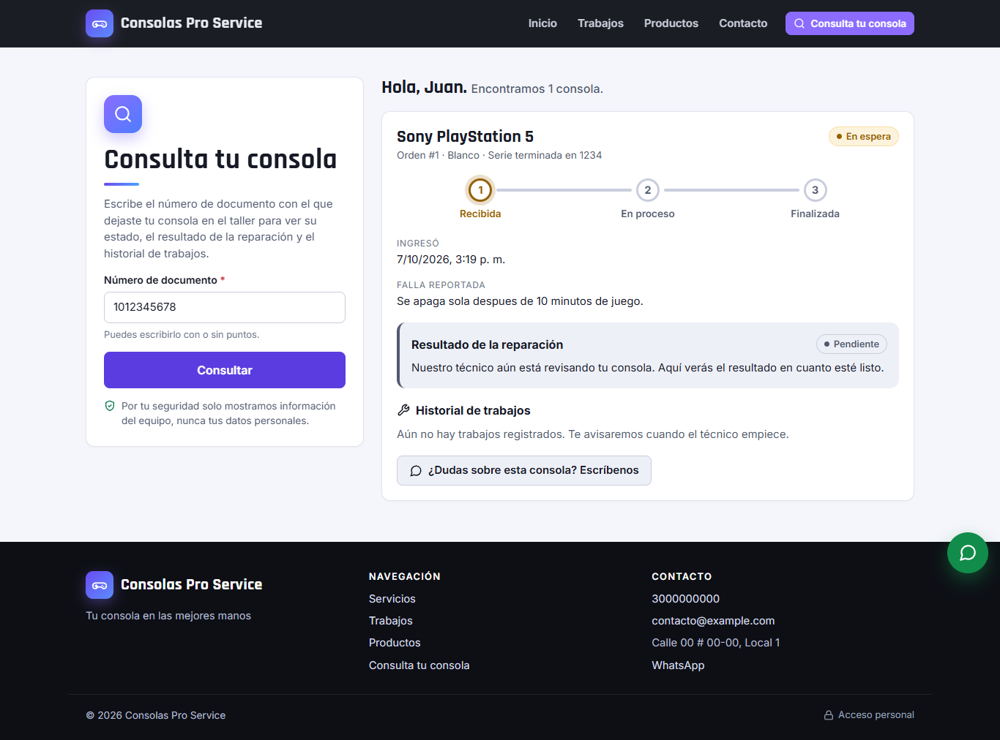
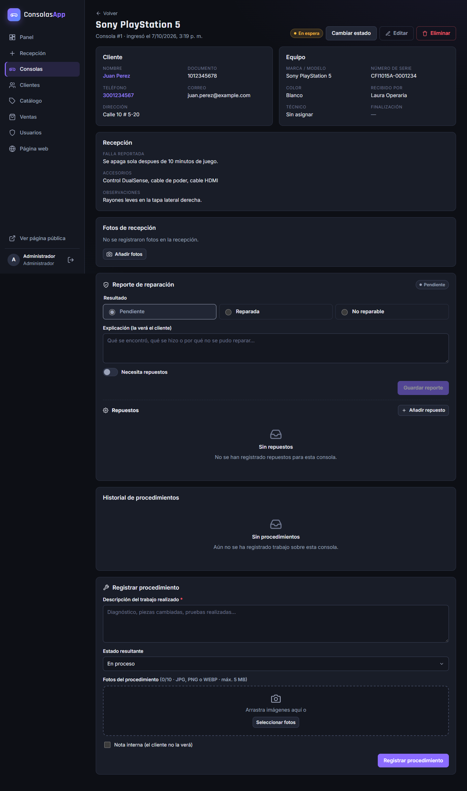

# Gestión de Taller de Consolas

**[Read in English](README.md)**

Aplicación web full stack para un emprendimiento de **mantenimiento, reparación y venta de consolas de videojuegos**. Reemplaza las planillas en papel y los chats de WhatsApp por un solo sistema para el personal del taller y una página pública donde los clientes consultan el estado de su consola.




## Qué hace

**Para los clientes (página pública, sin iniciar sesión)**
- Información del negocio, servicios, contacto y botón de WhatsApp.
- Galería de trabajos realizados (fotos y videos).
- Catálogo de productos con disponibilidad y mensaje "Lo quiero" prellenado para WhatsApp.
- **Consulta del estado de la reparación** con el número de documento: progreso (recibida → en proceso → finalizada), resultado de la reparación, repuestos necesarios, fotos e historial de trabajos. Nunca muestra datos personales, oculta las notas internas y tiene límite de intentos.

**Para el personal (panel interno con roles)**
| Rol | Puede |
|---|---|
| **Operario** (recepción) | Registrar clientes, recibir consolas con fotos, vender productos |
| **Técnico** | Registrar procedimientos con fotos, cambiar el estado, hacer el reporte de reparación, gestionar repuestos, escribir notas internas |
| **Administrador** | Todo lo anterior, más usuarios, catálogo, historial de ventas y contenido de la página pública |

| Consulta de estado | Detalle de consola (vista del técnico) |
|---|---|
|  |  |

## Tecnologías

| Capa | Tecnologías |
|---|---|
| Frontend | React 19, React Router 7, Vite 8, CSS propio (sin frameworks de UI), accesible y responsive |
| Backend | Node.js 24, Express 5, autenticación JWT, bcrypt, Multer (subidas validadas por firma del archivo), Helmet (CSP) |
| Base de datos | MySQL / MariaDB: 12 tablas normalizadas, claves foráneas, restricciones CHECK, índices según las consultas, migraciones versionadas |
| Pruebas | `node:test` + Supertest: 117 pruebas (unitarias e integración contra base de datos real) y pruebas en navegador con Playwright |
| Entrega | CI con GitHub Actions, modo producción con un solo servidor, Cloudflare Tunnel para publicar desde un equipo local |

La arquitectura, la seguridad y las decisiones de diseño están explicadas en el [caso de estudio](docs/caso-de-estudio.md).

## Ejecutarlo en local

Requisitos: Node.js 20+ y MySQL 8 / MariaDB 10.4+.

```bash
mysql -u root < database/schema.sql
mysql -u root consolas_db < database/seed.sql

cd backend && cp .env.example .env && npm install && npm run dev    # API en 127.0.0.1:3001
cd ../frontend && npm install && npm run dev                        # http://localhost:5173
```

Cuentas de demostración: `admin / Admin123*`, `tecnico / Tecnico123*`, `operario / Operario123*` (cámbialas antes de publicar). Documento de ejemplo para la consulta pública: `1012345678`.

En Windows hay lanzadores de un clic: `iniciar.bat`, `iniciar-desarrollo.bat`, `publicar.bat` (Cloudflare Tunnel) y `exportar.bat` / `instalar.bat` (copia completa y migración a otro equipo).

## Cómo se construyó

Construí este proyecto **dirigiendo un equipo de agentes de IA con [Claude Code](https://claude.com/claude-code)**. Yo hice de dueño del producto y orquestador:
- levanté los requisitos del negocio;
- tomé las decisiones de producto y de seguridad;
- revisé cada entrega y verifiqué los resultados.

Cada agente tenía un rol definido: orquestador, base de datos, backend, frontend y QA. Sus definiciones están en [`.claude/agents`](.claude/agents).

El proyecto creció en tres fases, cada una con su especificación escrita en [`docs/`](docs):
1. la app interna del taller;
2. la página pública y el reporte de reparación;
3. el endurecimiento de seguridad y la publicación.

## Licencia
[MIT](LICENSE)
