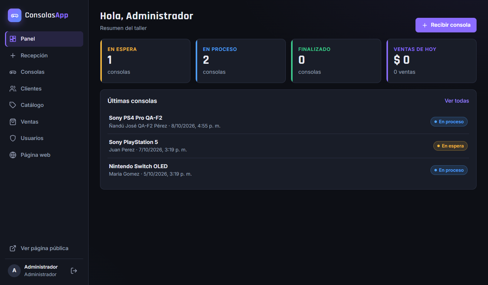
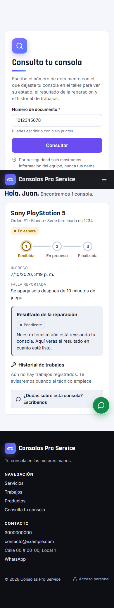

# Console Repair Shop Manager

**[Leer en español](README.es.md)**

A full-stack web application for a small video-game console business that does **maintenance, repair and sales**. It replaces paper forms and WhatsApp threads with one system for the workshop staff and a public website where customers can check the status of their console.


## What it does

**For customers (public site, no login)**
- Business information, services, contact details and a WhatsApp button.
- Gallery of completed jobs (photos and videos).
- Product catalog with availability and a pre-filled WhatsApp "I want it" message.
- **Repair status lookup** by ID number: progress (received → in progress → finished), repair result, required spare parts, photos and job history. Personal data is never shown, internal notes are hidden and lookups are rate-limited.

**For staff (internal panel, role-based)**
| Role | Can do |
|---|---|
| **Operator** (front desk) | Register customers, receive consoles with photos, sell products |
| **Technician** | Log procedures with photos, change status, write the repair report, track spare parts, add internal notes |
| **Administrator** | Everything above, plus users, catalog, sales history and the public website content |

| Repair status lookup | Console detail (technician view) |
|---|---|
|  |  |

| Staff dashboard | Mobile |
|---|---|
|  |  |

## Tech stack

| Layer | Technologies |
|---|---|
| Frontend | React 19, React Router 7, Vite 8, hand-written CSS (no UI framework), accessible and responsive |
| Backend | Node.js 24, Express 5, JWT authentication, bcrypt, Multer (uploads validated by file signature), Helmet (CSP) |
| Database | MySQL / MariaDB: 12 normalized tables, foreign keys, CHECK constraints, indexes per query, versioned migrations |
| Testing | `node:test` + Supertest: 117 tests (unit + integration against a real database), Playwright browser checks |
| Delivery | GitHub Actions CI, single-server production mode, Cloudflare Tunnel for publishing from a local machine |

## Architecture

```
Browser ──► Express (single server, port 5173 in production)
             ├── /            React app (compiled with Vite)
             ├── /api/*       REST API (43 endpoints, JWT + role checks)
             └── /uploads/*   Photos and videos (validated by content)
                     │
                     ▼
              MySQL / MariaDB (consolas_db)

Internet ──► Cloudflare Tunnel (cloudflared) ──► localhost:5173
```

Key design decisions are documented in the [case study](docs/case-study.md).

## Security highlights
- Role-based authorization on every route, checked against a permission matrix.
- Passwords hashed with bcrypt; minimum strength policy; generic login errors.
- Login and public lookup **rate limits per real client IP** (trusts `CF-Connecting-IP` only from the local tunnel, so LAN clients cannot spoof it).
- Uploads validated by **magic bytes**, not by extension; size limits per type; orphan files cleaned up.
- Parameterized SQL everywhere, SQL strict mode, whitelisted enums.
- Content-Security-Policy and security headers in production; HSTS only over HTTPS.
- The public lookup returns an explicit whitelist of fields: no phone, email, address, full serial number or internal notes.
- The publish script refuses to go online while any account still uses a sample password.

## Run it locally

Requirements: Node.js 20+ and MySQL 8 / MariaDB 10.4+.

```bash
# 1. Database
mysql -u root < database/schema.sql
mysql -u root consolas_db < database/seed.sql

# 2. Backend (API on http://127.0.0.1:3001)
cd backend
cp .env.example .env        # set DB credentials and a random JWT_SECRET
npm install
npm run dev

# 3. Frontend (http://localhost:5173)
cd ../frontend
npm install
npm run dev
```

Demo accounts from the seed: `admin / Admin123*`, `tecnico / Tecnico123*`, `operario / Operario123*`. Change them before exposing the app anywhere. Sample customer ID for the public lookup: `1012345678`.

On Windows there are one-click launchers: `iniciar.bat` (production mode), `iniciar-desarrollo.bat`, `publicar.bat` (Cloudflare Tunnel), and `exportar.bat` / `instalar.bat` (full backup and migration to another PC).

Tests: `cd backend && npm test` (integration tests run when the database is reachable).

## How it was built

I built this project by **directing a team of AI agents with [Claude Code](https://claude.com/claude-code)**. I acted as product owner and orchestrator: I gathered the business requirements, made the product and security decisions, reviewed every delivery and verified the results. The agents each had a defined role, and their definitions are in [`.claude/agents`](.claude/agents):

| Agent | Responsibility |
|---|---|
| Orchestrator | Breaks the request into tasks, writes the shared spec, delegates and integrates |
| Database | Schema, migrations, indexes, integrity |
| Backend | API, business logic, security |
| Frontend | UI, UX, accessibility |
| QA | Code review, automated and browser tests, fixes |

The project grew in three phases, each with its own written specification in [`docs/`](docs): the internal workshop app, then the public website with the repair report, and finally production hardening and publishing. QA found and fixed real issues along the way, for example uploads that trusted the declared file type, a gallery layout bug and a tunnel that stayed open after closing its window.

## Project structure
```
backend/    Express API, middleware, services, tests
frontend/   React app (public site + staff panel)
database/   schema.sql, seed.sql, migrations
docs/       Specifications per phase, case study, screenshots
.claude/    AI agent team definitions
*.bat       Windows launchers (run, publish, backup, install)
```

## License
[MIT](LICENSE)
